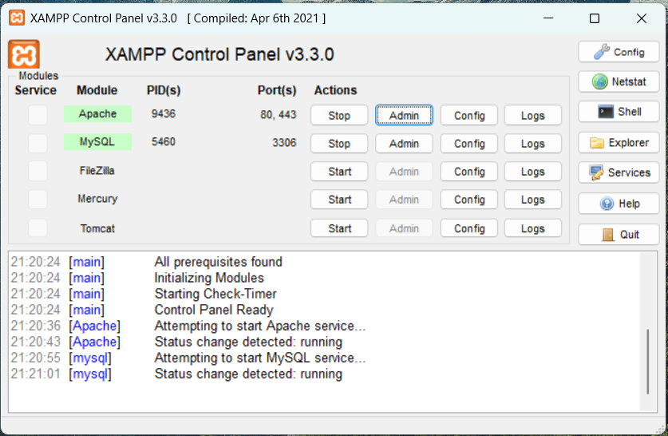
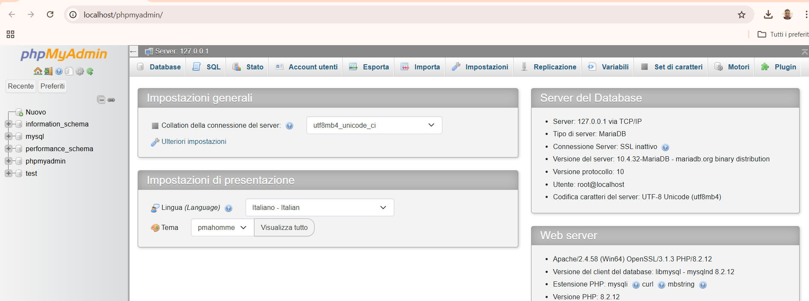
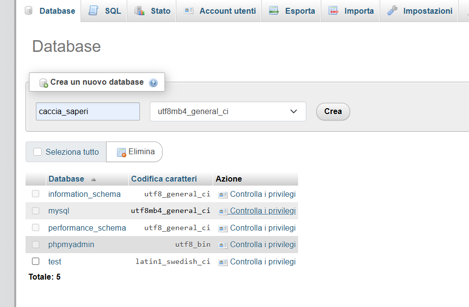

# Puzzle Lab

# README: Installazione di XAMPP e Avvio di un File JAR con Java 17

## Requisiti
- **Sistema Operativo**: Windows, macOS o Linux
- **XAMPP**: Versione compatibile con il tuo sistema operativo
- **Java**: Versione 17
- **File JAR**: Assicurati che il file JAR sia disponibile e funzionante

---

## 1. Installazione di XAMPP

### Passo 1: Scaricare XAMPP
1. Visita il sito ufficiale di XAMPP: [https://www.apachefriends.org/index.html](https://www.apachefriends.org/index.html)
2. Seleziona la versione adatta al tuo sistema operativo.
3. Scarica il file di installazione.

### Passo 2: Installare XAMPP
1. Avvia il file di installazione scaricato.
2. Segui le istruzioni guidate:
   - Seleziona i componenti necessari (Apache, MySQL, ecc.).
   - Scegli la directory di installazione (di default: `C:\xampp` su Windows).
3. Completa l'installazione.

### Passo 4: Avviare XAMPP
1. Apri il pannello di controllo di XAMPP.
2. Avvia i servizi necessari:
   - **Apache**: per eseguire un server web.
   - **MySQL**: per il database.
3. Verifica il funzionamento:
   - Dovresti avere il pannello di controllo in questo modo:
   
4. Clicca su Admin tra le opzioni di MySQL:
   - Dovresti ottenere una pagina del genere:
   
5. Crea il database:
   - Clicca in alto a sinistra su nuovo.
   - metti come nome del database caccia_saperi in questo modo e poi clicca su crea:
   
---
## 2. Importazione del Dump del Database

Per configurare il database, segui questi passaggi per importare il file dump:

### Passo 1: Preparazione
1. Assicurati che **MySQL** sia avviato dal pannello di controllo di XAMPP.
2. Individua il file del dump del database. Dovrebbe avere un'estensione come `.sql`.

### Passo 2: Accedi a phpMyAdmin
1. Apri il browser e vai su [http://localhost/phpmyadmin](http://localhost/phpmyadmin).
2. Seleziona il database **caccia_saperi** creato in precedenza.

### Passo 3: Importa il file
1. Clicca sulla scheda **Importa** nel menu superiore.
2. Sotto "File da importare":
   - Clicca su **Scegli file** e seleziona il file dump `.sql`.
3. Controlla che il formato sia impostato su `SQL`.
4. Clicca su **Esegui** per avviare l'importazione.

Se l'importazione ha successo, vedrai un messaggio di conferma. Il database è ora pronto per essere utilizzato con il server.


---

## 3. Installazione di Java 17

### Passo 1: Scaricare Java 17
1. Vai al sito ufficiale di Oracle: [https://www.oracle.com/java/technologies/javase/jdk17-archive-downloads.html](https://www.oracle.com/java/technologies/javase/jdk17-archive-downloads.html)
2. Scarica il pacchetto Java Development Kit (JDK) 17 per il tuo sistema operativo.

### Passo 2: Installare Java 17
1. Avvia il file di installazione.
2. Segui le istruzioni guidate per completare l'installazione.
3. Verifica l'installazione:
   - Apri un terminale (o il prompt dei comandi su Windows).
   - Digita: `java -version`.
   - Dovresti vedere una versione simile a questa:
     ```
     java version "17.x.x"
     Java(TM) SE Runtime Environment (build 17.x.x)
     Java HotSpot(TM) 64-Bit Server VM (build ...)
     ```

---

## 4. Avvio del server

Nella directory principale della repository troverai un file chiamato **Server-Start.bat**. Per avviare il server, segui questi passi:

1. **Individua il file**: Vai nella cartella della repository del progetto.
2. **Esegui il file**: Fai doppio clic su **Server-Start.bat**.
3. **Mantieni la finestra aperta**: Assicurati che la finestra che si apre rimanga aperta. Questo indica che il server è in esecuzione.
   - Se chiudi questa finestra, il server smetterà di funzionare.

Verifica il corretto avvio controllando eventuali messaggi di log nella finestra.
